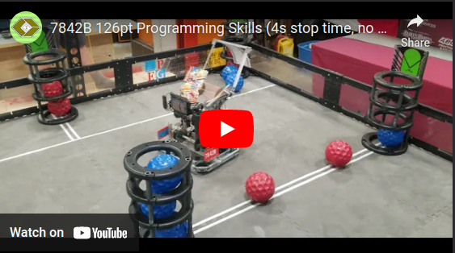

# lib7842

lib7842 is a collection of powerful utilities and motion algorithms for VEX V5
robots. Designed to be used with the [PROS](https://pros.cs.purdue.edu/)
framework, it builds on top of the
[OkapiLib](https://github.com/OkapiLib/OkapiLib) library. lib7842 was in
development during my time on the
[7842F/B](https://theol0403.github.io/7842B-Journal/) robotics team between
2018-2021.

This is released as-is, with little documentation (other than the source code)
and no support. All source code is located in
[`/include/lib7842/`](/include/lib7842/) and [`/src/lib7842/`](/src/lib7842/).

Major features:

- Constexpr spline representation and generation
- Open-loop skid-steer and x-drive trajectory generation
- Convenience classes for asynchronous actions and task management
- Three-encoder and two-encoder odometry
- Pure pursuit path following
- LVGL-based GUI system for displaying important information on the V5 Brain

Some parts of the library, especially the odometry and trajectory generation,
are documented in my [journal](https://theol0403.github.io/7842B-Journal/).

Example usage of the library, and what is possible using an autonomous routine,
is available in my
[change up competition code](https://github.com/theol0403/7842B-Change-Up).

## Demo

Demonstration of open-loop trajectory generator:

6th-place world skills run:

Constructed using desired trajectories like this:

Resulting in pre-planned wheel velocities like this:

## Features

### Trajectory Generation

- [Introduction](https://theol0403.github.io/7842B-Journal/2020-06-01/introduction/)
  |
  [Journal](https://theol0403.github.io/7842B-Journal/2020-06-22/trajectory-journal/)
  | [Python Simulation](https://github.com/theol0403/python-profile)
- 1D Trapezoidal Motion Profile, parameterized for distance, supporting
  piecewise velocity waypoints
  ([`api/trajectory/profile`](https://github.com/theol0403/lib7842/tree/develop/include/lib7842/api/trajectory/profile))
- Skid-steer open-loop trajectory generation
  ([`trajectory/skidGenerator.hpp`](https://github.com/theol0403/lib7842/blob/develop/include/lib7842/api/trajectory/generator/skidGenerator.hpp) +
  [`trajectory/skidGenerator.cpp`](https://github.com/theol0403/lib7842/blob/develop/src/lib7842/api/trajectory/skidGenerator.cpp)),
  with high-speed computation and oversaturation protection.
- X-drive open-loop trajectory generation
  ([`trajectory/xGenerator.hpp`](https://github.com/theol0403/lib7842/blob/develop/include/lib7842/api/trajectory/generator/xGenerator.hpp) +
  [`trajectory/xGenerator.cpp`](https://github.com/theol0403/lib7842/blob/develop/src/lib7842/api/trajectory/xGenerator.cpp)),
  with arbitrary heading profiling and waypoints
  - supports following the trajectory like a skid-steer (at an arbitrary start
    heading), or rotating while driving

### Convenience

- Async actions for chassis controllers
  ([`include/api/async`](https://github.com/theol0403/lib7842/tree/develop/include/lib7842/api/async) +
  [`src/api/async`](https://github.com/theol0403/lib7842/tree/develop/src/lib7842/api/async)
  | `Async/Trigger` )
- Convenience class for creating subsystems that use Tasks
  ([`TaskWrapper`](https://github.com/theol0403/lib7842/blob/develop/include/lib7842/api/async/taskWrapper.hpp)
  |
  [Writeup](https://theol0403.github.io/7842B-Journal/2019-10-18/task-wrapper/))
- Modular GUI system for rapidly displaying important information on the V5
  Brain using LVGL
  ([`api/gui`](https://github.com/theol0403/lib7842/tree/develop/include/lib7842/api/gui)
  | `GUI`)
  - Easy selectors, buttons, graphs, odom display, vision display, and more
- V5 Vision Sensor Filtering and Processing
  ([`include/api/vision`](https://github.com/theol0403/lib7842/tree/develop/include/lib7842/api/vision) +
  [`src/api/vision`](https://github.com/theol0403/lib7842/tree/develop/src/lib7842/api/vision)
  | `Container/Vision` |
  [Writeup](https://theol0403.github.io/7842B-Journal/2021-02-19/vision-alignment/))

### Odometry

- Three-Encoder Odometry
  ([`customOdometry.hpp`](https://github.com/theol0403/lib7842/blob/develop/include/lib7842/api/odometry/customOdometry.hpp) +
  [`customOdometry.cpp`](https://github.com/theol0403/lib7842/blob/develop/src/lib7842/api/odometry/customOdometry.cpp))
- Skid-Steer PID-based chassis controller
  ([`odomController.hpp`](https://github.com/theol0403/lib7842/blob/develop/include/lib7842/api/odometry/odomController.hpp) +
  [`odomController.cpp`](https://github.com/theol0403/lib7842/blob/develop/src/lib7842/api/odometry/odomController.cpp)
  |
  [Writeup](https://theol0403.github.io/7842B-Journal/2019-11-15/odom-controller/))
  - Supports custom behaviour for turning, settling, and async actions
- X-drive PID-based chassis controller
  ([`odomXController.hpp`](https://github.com/theol0403/lib7842/blob/develop/include/lib7842/api/odometry/odomXController.hpp) +
  [`odomXController.cpp`](https://github.com/theol0403/lib7842/blob/develop/src/lib7842/api/odometry/odomXController.cpp)
  |
  [Writeup](https://theol0403.github.io/7842B-Journal/2019-11-20/odom-x-controller/))
  - Supports custom behaviour for turning while strafing, settling, and async
    actions

### Path Following

- Comprehensive path representation library
  ([`api/positioning/spline`](https://github.com/theol0403/lib7842/tree/develop/include/lib7842/api/positioning/spline))
  - Arcs, n-th degree Bézier curves, Hermite splines, arc meshing, and more
  - Full constexpr compile-time sampling support
- Pure Pursuit path following
  ([`include/api/purePursuit`](https://github.com/theol0403/lib7842/tree/develop/include/lib7842/api/purePursuit) +
  [`src/api/purePursuit`](https://github.com/theol0403/lib7842/tree/develop/src/lib7842/api/purePursuit)
  |
  [Writeup](https://theol0403.github.io/7842B-Journal/2019-11-25/pure-pursuit/))
  - Skid-steer pure pursuit controller with improved settling behaviour
    ([`pathFollower.hpp`](https://github.com/theol0403/lib7842/blob/develop/include/lib7842/api/purePursuit/pathFollower.hpp) +
    [`pathFollower.cpp`](https://github.com/theol0403/lib7842/blob/develop/src/lib7842/api/purePursuit/pathFollower.cpp))
  - X-drive pure pursuit controller with custom turning-while-strafing behaviour
    ([`pathFollowerX.hpp`](https://github.com/theol0403/lib7842/blob/develop/include/lib7842/api/purePursuit/pathFollowerX.hpp) +
    [`pathFollowerX.cpp`](https://github.com/theol0403/lib7842/blob/develop/src/lib7842/api/purePursuit/pathFollowerX.cpp))

## Architecture

- Built on top of OkapiLib device abstractions, so is platform-agnostic
- Can be built on PC using OkapiLib mocking library
- LVGL GUI library can be developed on PC
- Unit tests written for most components using `doctest`
  - Tests are included in class source files
  - Tests are run both in CI but also on `debug` deployments on the V5
- Use git flow for development
